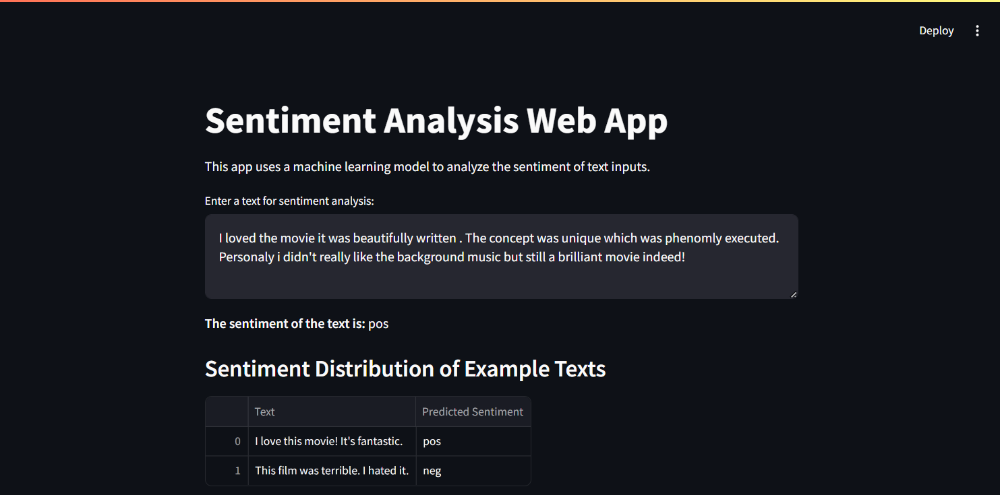
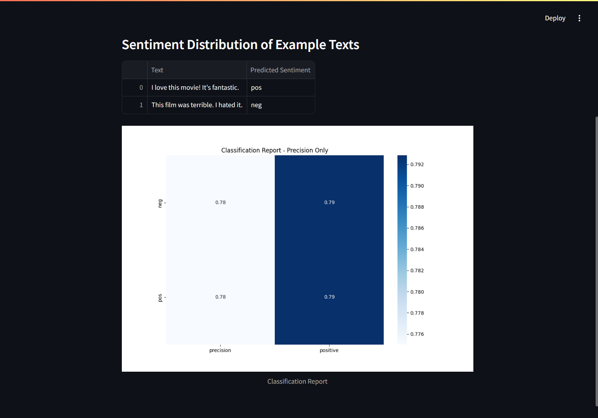

# 🎬 Sentiment Analysis of Movie Reviews

This project implements a **sentiment analysis** system for movie reviews using machine learning techniques. It classifies the sentiment of text inputs as either **positive** 😊 or **negative** 😞, providing a simple interface for users to analyze movie reviews.

---

## 🌟 Features

- **Machine Learning Model** 🧠: Utilizes a Naive Bayes classifier trained on the NLTK movie reviews dataset.
- **User Interface** 💻: Built using **Streamlit**, allowing users to input text and receive sentiment predictions.
- **Visualization** 📊: Displays a classification report and sentiment distribution for example texts.

---

## 🛠️ Technologies Used

- **Python** 🐍: The programming language for implementing the sentiment analysis model.
- **NLTK** 📚: Natural Language Toolkit for accessing the movie reviews dataset.
- **Scikit-learn** 📈: Machine learning library for building and evaluating the classification model.
- **Streamlit** 🌐: Framework for creating interactive web applications.
- **Matplotlib and Seaborn** 🎨: Libraries for data visualization.

---

## 🎥 Dataset

The project uses the **movie reviews** dataset from the NLTK library, which consists of a collection of movie reviews categorized as positive or negative.

---

## 🛠️ How It Works

1. **Data Loading** 📦: The application loads the movie reviews dataset and prepares it for analysis.
2. **Data Preparation** ✂️: Reviews are split into training and testing sets for model evaluation.
3. **Model Training** 🎓: A pipeline is created combining TF-IDF for feature extraction and a Naive Bayes classifier for sentiment classification.
4. **Predictions** 🔮: The model predicts sentiment for user-provided text and displays results.
5. **Visualization** 📊: A classification report is generated, showing accuracy and precision metrics, with visual representations of the results.

---

## 📸 Screenshots

### 1️⃣ Main Task Window


### 2️⃣ Report


## 🚀 Usage

To run the **Streamlit app**, save the script as `Sentiment.py` and execute the following command in your terminal:

```bash
streamlit run Sentiment.py
